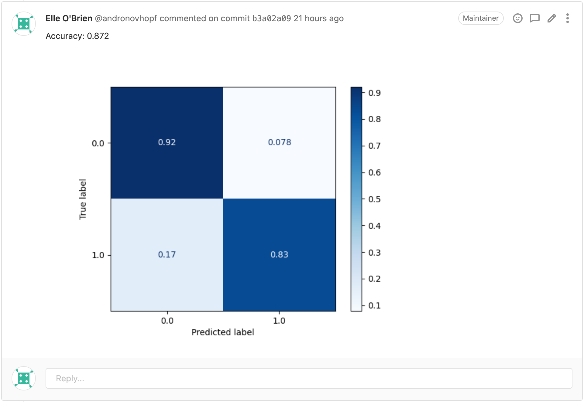
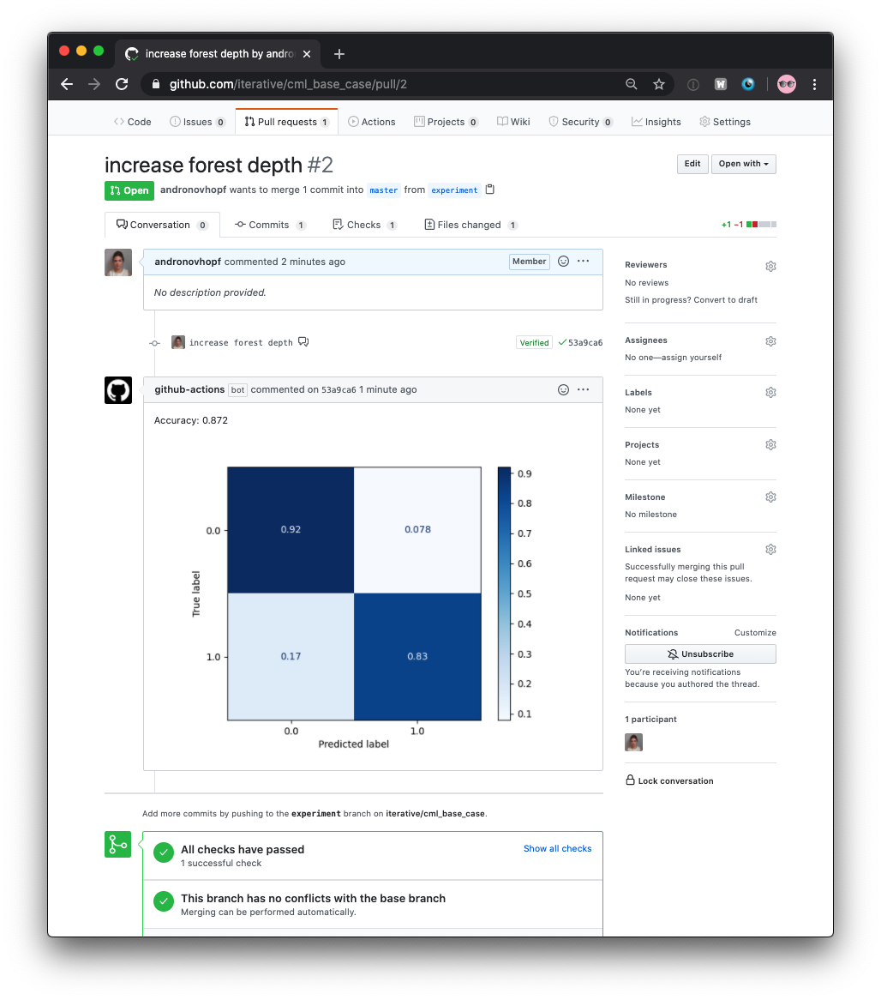
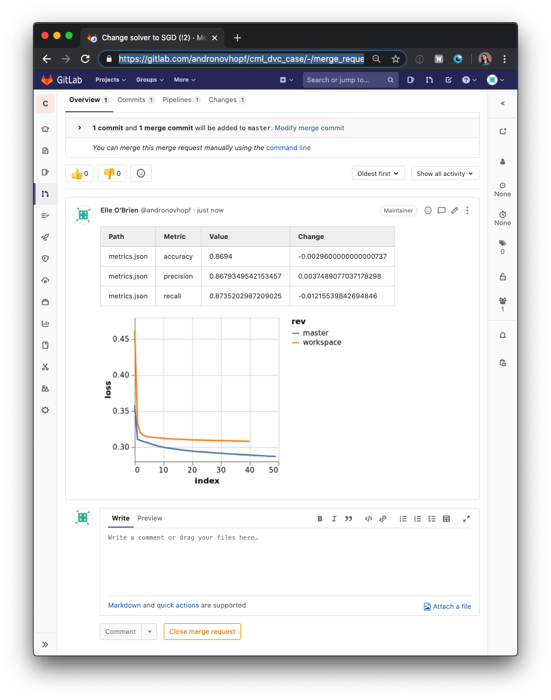
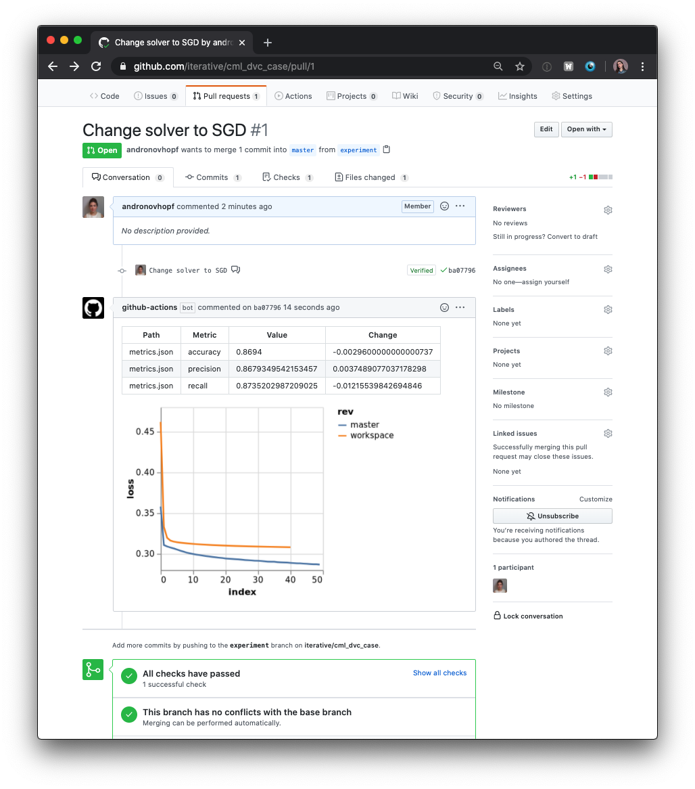
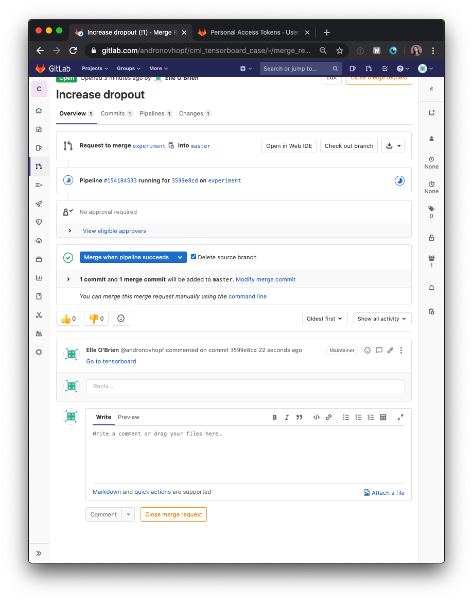
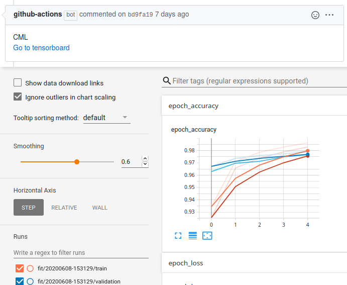
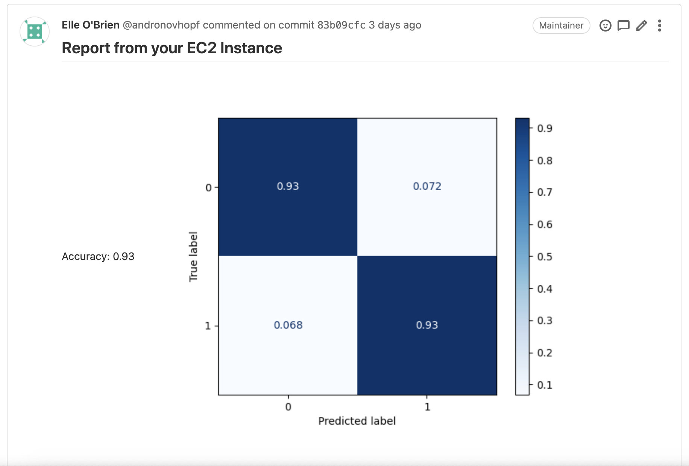
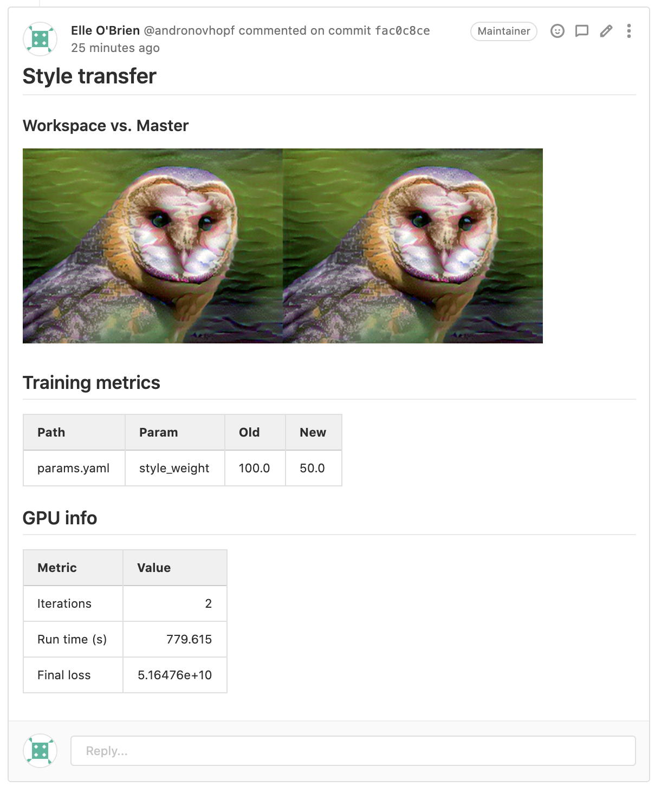

import Header from "components/organisms/SiteHeader"
import Footer from "components/organisms/SiteFooter"
import SubscribeSection from "components/molecules/SubscribeSection"

import GitFlowIcon from "media/icons/gitflow.svg"
import ReportsIcon from "media/icons/reports.svg"
import BoxIcon from "media/icons/cube.svg"

import githubVideoMp4 from "media/github/landing-video.mp4"
import gitlabVideoMp4 from "media/gitlab/landing-video.mp4"

import LandingVideo from "components/molecules/Video/LandingVideo"
import backgroundImage from "media/landing-background.png"

export default ({ children, ...props }) => {
  return (
    <>
      <main>{children}</main>
      <SubscribeSection />
      <Footer />
    </>
  )
}

<FullWidthBox sx={{
  backgroundColor: "text",
  backgroundImage: [null, null, null, `url("${backgroundImage}")`],
  backgroundPosition: "center top",
  backgroundRepeat: "no-repeat",
  color: "background",
  overflow: "hidden",
  textAlign: "center",
  Inner: {
    maxWidth: "100%",
    px: 0
  }
}}>
  <Header />
  <Collapser sx={{
    variant: "layout.container",
    height: [null, null, null, "618px"],
    justifyContent: "center",
    alignItems: "center"
  }}>
    <Box sx={{flex: "1", textAlign: ["center", null, "left"]}}>
      <Heading as="h1" sx={{
        fontSize: ["32px", null, null, "42px"],
        my: 4,
        ml: 2,
        mr: [2, null, "45px"],
        maxWidth: "500px"
      }}>
        Continuous Machine Learning (CML) is CI/CD for Machine Learning Projects
      </Heading>
      <Link variant="button" href="https://github.com/iterative/cml#getting-started" target="_blank" rel="noopener noreferrer">
        Get Started
      </Link>
    </Box>
    <Box sx={{flex: "1", width: "100%"}}>
      <Switch sx={{ mt: 4, mx: "auto", maxWidth: ["100%", null, "160px"] }} />
      <Switchable
        gitlab={<LandingVideo src={gitlabVideoMp4} mode="gitlab" />}
        github={<LandingVideo src={githubVideoMp4} mode="github" />}
      />
    </Box>
  </Collapser>

  <Collapser sx={{variant: "layout.container", my: 4, flexDirection: ["column", null, null, "row"]}}>
  <HomeFeature heading="GitFlow for data science" icon={GitFlowIcon}>

Use GitLab or GitHub to manage ML experiments, track who trained ML models or
modified data and when. Codify data and models with DVC instead of pushing to
your Git repo.

  </HomeFeature>
  <HomeFeature heading="Auto reports for ML experiments" icon={ReportsIcon}>

Auto-generate reports with metrics and plots in each Git Pull Request.
Rigorous engineering practices help your team make informed, data-driven
decisions.

  </HomeFeature>
  <HomeFeature heading="No additional services" icon={BoxIcon}>

Build your own ML platform using just GitHub or GitLab and your favorite cloud
services: AWS, Azure, GCP. No databases, services or complex setup needed.

  </HomeFeature>
  </Collapser>

</FullWidthBox>

<FullWidthBox
  id="use-cases"
  sx={{
    textAlign: "center",
    py: "1px",
    fontSize: "18px",
    lineHeight: "28px",
    letterSpacing: "0.02em",
    Inner: {
      my: "80px",
      px: [0, null, null, 3]
    }
  }}
>

<Heading
  as="h2"
  sx={{
    color: "text",
    fontSize: ["32px", null, "42px"],
    lineHeight: "52px",
    fontWeight: "bold"
  }}
>
  CML Use Cases
</Heading>

<Box sx={{
  mx: "auto",
  px: "10px",
  maxWidth: "635px",
  my: "40px"
}}>

The simplest case of using CML, and a clear way for any user to get started, is to generate a simple report. Add the following .yaml to your project repository and commit to get started

</Box>

<Switch sx={{ my: 4, maxWidth: "160px", mx: "auto" }} />

<JSONTabs
  sx={{ "code, img": {maxHeight: "580px"} }}
  content={[
  {
    name: "First CML Report",
    filename: "cml.yaml",
    content: (
      <Switchable
        gitlab={(
<Collapser>

```yml filename=".gitlab-ci.yml" repo="https://gitlab.com/iterative.ai/cml-base-case"
stages:
  - cml_run

cml:
  stage: cml_run
  image: dvcorg/cml-py3:latest
  script:
    <Tooltip type="dependencies">
    - pip3 install -r requirements.txt
    - python train.py
    </Tooltip>

    <Tooltip type="reports">
    - cat metrics.txt >> report.md
    - cml-publish confusion_matrix.png --md >> report.md
    - cml-send-comment report.md
    </Tooltip>
```

<ExampleBox title="CML Report">


[](https://gitlab.com/iterative.ai/cml-base-case/-/merge_requests/3)


</ExampleBox>

</Collapser>
        )}
        github={(
<Collapser>

```yml filename=".github/workflows/cml.yaml" repo="https://github.com/iterative/cml_base_case"
name: train-my-model

on: [push]

jobs:
  run:
    runs-on: [ubuntu-latest]

    steps:
      - uses: actions/checkout@v2
      
      - uses: iterative/setup-cml@v1

      - uses: actions/setup-python@v2
        with:
          python-version: '3.x'

      - name: cml
        env:
          repo_token: { "${{ secrets.GITHUB_TOKEN }}" }
        run: |
          <Tooltip type="dependencies">
          pip3 install -r requirements.txt
          python train.py
          </Tooltip>

          <Tooltip type="reports">
          cat metrics.txt >> report.md
          cml-publish confusion_matrix.png --md >> report.md
          cml-send-comment report.md
          </Tooltip>
```

<ExampleBox title="CML Report">

[](https://github.com/iterative/cml_base_case/pull/2)

</ExampleBox>

</Collapser>
        )}
      />
    )
  },
  {
    name: "DVC",
    content: (
      <Switchable
        gitlab={(
<Collapser>

```yml filename=".gitlab-ci.yml" repo="https://gitlab.com/iterative.ai/cml-dvc-case"
stages:
  - cml_run

cml:
  stage: cml_run
  image: dvcorg/cml-py3:latest
  script:
    <Tooltip type="dvc">
    - dvc pull data
    </Tooltip>

    <Tooltip type="dependencies">
    - pip install -r requirements.txt
    - dvc repro
    </Tooltip>

    # Compare metrics to master
    - git fetch --prune
    - dvc metrics diff --show-md master >> report.md

    # Visualize loss function diff
    - dvc plots diff 
      --target loss.csv --show-vega master > vega.json
    <Tooltip type="reports">
    - vl2png vega.json | cml-publish --md >> report.md
    - cml-send-comment report.md
    </Tooltip>
```

<ExampleBox title="CML Report">

[](https://gitlab.com/iterative.ai/cml-dvc-case/-/merge_requests/6)

</ExampleBox>

</Collapser>
        )}
        github={(
<Collapser>

```yml filename=".github/workflows/cml.yaml" repo="https://github.com/iterative/cml_dvc_case"
name: train-my-model

on: [push]

jobs:
  run:
    runs-on: [ubuntu-latest]
  
    steps:
      - uses: actions/checkout@v2

      - uses: iterative/setup-cml@v1

      - uses: iterative/setup-dvc@v1

      - uses: actions/setup-python@v2
        with:
          python-version: '3.x'

      - name: cml
        env:
          repo_token: { "${{ secrets.GITHUB_TOKEN }}" }
          <Tooltip type="dvc">
          AWS_ACCESS_KEY_ID: { "${{ secrets.KEY_ID }}" }
          AWS_SECRET_ACCESS_KEY: { "${{ secrets.KEY }}" }
          </Tooltip>
        run: |
          <Tooltip type="dvc">
          dvc pull data
          </Tooltip>
          
          <Tooltip type="dependencies">
          pip install -r requirements.txt
          dvc repro
          </Tooltip>

          # Compare metrics to master
          git fetch --prune 
          dvc metrics diff --show-md master >> report.md

          # Visualize loss function diff
          dvc plots diff \
            --target loss.csv --show-vega master > vega.json
          <Tooltip type="reports">
          vl2png vega.json -s 1.5 | cml-publish --md  >> report.md
          cml-send-comment report.md 
          </Tooltip>
```

<ExampleBox title="CML Report">

[](https://github.com/iterative/cml_dvc_case/pull/4)

</ExampleBox>

</Collapser>
        )}
      />
    )
  },
  {
    name: "Tensorboard",
    content: (
      <Switchable
        gitlab={(
<Collapser>

```yml filename=".gitlab-ci.yml" repo="https://gitlab.com/iterative.ai/cml-tensorboard-case"
stages: 
    - cml_run
    
cml:
    stage: cml_run
    image: dvcorg/cml-py3:latest
    script:
        - pip install -r requirements.txt
        <Tooltip type="tensorboard">
        - cml-tensorboard-dev \
            --logdir logs \
            --name "Go to tensorboard" \
            --md >> report.md
        </Tooltip>
        <Tooltip type="reports">
        - cml-send-comment report.md
        </Tooltip>

        <Tooltip type="dependencies">
        - python train.py
        </Tooltip>

```

<ExampleBox title="CML Report">

[](https://gitlab.com/iterative.ai/cml-tensorboard-case/-/merge_requests/2)

</ExampleBox>

</Collapser>
        )}
        github={(
<Collapser>

```yml filename=".github/workflows/cml.yaml" repo="https://github.com/iterative/cml_tensorboard_case"
name: train-my-model

on: [push]

jobs:
  run:
    runs-on: [ubuntu-latest]

    steps:
      - uses: actions/checkout@v2

      - uses: iterative/setup-cml@v1
      
      - uses: actions/setup-python@v2
        with:
          python-version: '3.6'

      - name: cml
        env:
          repo_token: { "${{ secrets.GITHUB_TOKEN }}" }
          <Tooltip type="tensorboard">
          TB_CREDENTIALS: { "${{ secrets.TB_CRED }}" }
          </Tooltip>
        run: |
          pip install -r requirements.txt

          <Tooltip type="tensorboard">
          cml-tensorboard-dev \
            --logdir logs \
            --name "Go to tensorboard" \
            --md >> report.md
          </Tooltip>
          <Tooltip type="reports">
          cml-send-comment report.md
          </Tooltip>

          <Tooltip type="dependencies">
          python train.py
          </Tooltip>
```

<ExampleBox title="CML Report">

[](https://github.com/iterative/cml_tensorboard_case/pull/1)

</ExampleBox>

</Collapser>
        )}
      />
    )
  },
  ,
  {
    name: "CML Runner Cloud",
    content: (
      <Switchable
        gitlab={(
<Collapser>

```yml filename=".gitlab-ci.yml" repo="https://gitlab.com/iterative.ai/cml-runner-example"
stages:
  - deploy
  - train

deploy_job:
  stage: deploy
  when: always
  image: dvcorg/cml
  script:
    <Tooltip type="reports">
    - cml-runner
      --cloud aws
      --cloud-region us-west
      --cloud-type t2.micro
      --labels=cml-runner
    </Tooltip>

train_job:
 <Tooltip type="reports">
  stage: train
  when: on_success
  image: dvcorg/cml-py3
  tags:
    - cml-runner
  </Tooltip>

  script:
    - pip install -r requirements.txt
    - python train.py

    - echo "## Report from your EC2 Instance" > report.md
    - cat metrics.txt >> report.md
    - cml-publish "confusion_matrix.png" --md >> report.md
    - cml-send-comment report.md

```

<ExampleBox title="CML Report">

[](https://gitlab.com/iterative.ai/cml-runner-example/-/merge_requests/2)

</ExampleBox>

</Collapser>
        )}
        github={(
<Collapser>

```yml filename=".github/workflows/cml.yaml" repo="https://github.com/iterative/cml-runner-base-case"
name: train-my-model

on: [push]

jobs:
  deploy-runner:
    runs-on: [ubuntu-latest]
    steps:
      - uses: actions/checkout@v2

      - uses: iterative/setup-cml@v1

      - name: deploy
        shell: bash
        env:
          repo_token: { "${{ secrets.PERSONAL_ACCESS_TOKEN }}" }
          AWS_ACCESS_KEY_ID: { "${{ AWS_ACCESS_KEY_ID.PERSONAL_ACCESS_TOKEN }}" }
          AWS_SECRET_ACCESS_KEY: { "${{ secrets.AWS_SECRET_ACCESS_KEY }}" }
        run: |
          <Tooltip type="reports">
          cml-runner \
          --cloud aws \
          --cloud-region us-west \
          --cloud-type=t2.micro \
          --labels=cml-runner
          </Tooltip>

  run:
    <Tooltip type="reports">
    needs: deploy-runner
    runs-on: [self-hosted,cml-runner]
    container: docker://dvcorg/cml
    </Tooltip>

    steps:
    - uses: actions/checkout@v2

    - uses: actions/setup-python@v2
        with:
          python-version: '3.6'

    - name: cml
      env:
        repo_token: { "${{ secrets.PERSONAL_ACCESS_TOKEN }}" }
      run: |
        python --version
        pip install -r requirements.txt
        python train.py

        echo "## Report from your EC2 Instance" > report.md
        cat metrics.txt >> report.md
        cml-publish "confusion_matrix.png" --md >> report.md
        cml-send-comment report.md
```

<ExampleBox title="CML Report">

[](https://github.com/iterative/cml-runner-base-case/pull/4)

</ExampleBox>

</Collapser>
        )}
      />
    )
  },
  ,
  {
    name: "Advanced GPU Case",
    content: (
      <Switchable
        gitlab={(
<Collapser>

```yml filename=".gitlab-ci.yml" repo="https://gitlab.com/iterative.ai/cml-cloud-case"
stages:
  - deploy
  - train

deploy_job:
  stage: deploy
  when: always
  image: dvcorg/cml
  script:
    <Tooltip type="reports">
    - cml-runner \
      --cloud aws \
      --cloud-region us-west \
      --cloud-type=g3.4xlarge \
      --cloud-hdd-size 64 \
      --labels=cml-runner
    </Tooltip>

train_job:
  <Tooltip type="reports">
  stage: train
  when: on_success
  image: dvcorg/cml
  tags:
    - cml-runner
  </Tooltip>

  script:
    - apt-get update -y
    - apt-get install python3-dev -y
    - apt install imagemagick -y
    - pip install -r requirements.txt
    
    # DVC reproduce neural style transfer training
    - git fetch --prune
    - dvc repro
    
    # Compare master and workspace image results
    - echo "# Style transfer" >> report.md
    - git show origin/master:final_owl.png > master_owl.png
    - convert +append final_owl.png master_owl.png out.png
    - convert out.png -resize 75% out_shrink.png
    - echo "### Workspace vs. Master" >> report.md
    - cml-publish out_shrink.png --md >> report.md
    
    # Report training parameters
    - echo "## Training parameter diffs" >> report.md
    - dvc params diff master --show-md >> report.md
    - echo >> report.md
    
    # Report GPU details
    - echo "## GPU info" >> report.md
    - cat gpu_info.txt >> report.md
    
    - cml-send-comment report.md 


```

<ExampleBox title="CML Report">

[](https://gitlab.com/iterative.ai/cml-cloud-case/-/merge_requests/1)

</ExampleBox>

</Collapser>
        )}
        github={(
<Collapser>

```yml filename=".github/workflows/cml.yaml" repo="https://github.com/iterative/cml_cloud_case"
name: train-my-model

on: [push]

jobs:
  deploy-runner:
    runs-on: [ubuntu-latest]
    steps:
      - uses: actions/checkout@v2

      - uses: iterative/setup-cml@v1

      - name: deploy
        shell: bash
        env:
          repo_token: { "${{ secrets.secrets.PERSONAL_ACCESS_TOKEN }}" }
          AWS_ACCESS_KEY_ID: { "${{ secrets.AWS_ACCESS_KEY_ID }}" }
          AWS_SECRET_ACCESS_KEY: { "${{ secrets.AWS_SECRET_ACCESS_KEY }}" } 
        run: |
          <Tooltip type="reports">
          cml-runner \
          q
          </Tooltip>

  run:
    <Tooltip type="reports">
    needs: deploy-runner
    runs-on: [self-hosted,cml-runner]
    container: 
      image: docker://dvcorg/cml
    </Tooltip>
    <Tooltip type="tensorboard">
      options: --gpus all
    </Tooltip>

    steps:
    - uses: actions/checkout@v2

    - uses: actions/setup-python@v2
      with:
        python-version: '3.6'

    - name: cml
      env:
        repo_token: { "${{ secrets.secrets.PERSONAL_ACCESS_TOKEN }}" }
      run: |
        apt-get update -y
        apt install imagemagick -y
        pip install -r requirements.txt
        
        # DVC stuff
        git fetch --prune
        dvc repro
        
        echo "# Style transfer" >> report.md
        git show origin/master:final_owl.png > master_owl.png
        convert +append final_owl.png master_owl.png out.png
        convert out.png -resize 75%  out_shrink.png
        echo "### Workspace vs. Main" >> report.md
        cml-publish out_shrink.png --md --title 'compare' >> report.md
        
        echo "## Training metrics" >> report.md
        dvc params diff master --show-md >> report.md
        
        echo >> report.md
        echo "## GPU info" >> report.md
        cat gpu_info.txt >> report.md
        
        cml-send-comment report.md 
```

<ExampleBox title="CML Report">

[](https://github.com/iterative/cml_cloud_case/pull/11)

</ExampleBox>

</Collapser>
        )}
      />
    )
  }
]}/>

</FullWidthBox>

<FullWidthBox sx={{
  backgroundColor: "gray",
  textAlign: "center",
  py: "5px",
  Inner: {
    my: "85px",
  },
}}>

<Heading
  as="h2"
  sx={{
    color: "text",
    lineHeight: "52px",
    fontWeight: "bold",
    fontSize: ["32px", null, "42px"],
  }}
>
  The MLOps Ecosystem 
</Heading>

<Box sx={{
  fontSize: "18px",
  lineHeight: "28px",
  letterSpacing: "0.02em",
  mx: "auto",
  maxWidth: "460px",
}}>

MLOps isn't a platform- it's an ecosystem of tools. 
CML helps you bring your favorite DevOps tools to machine learning. 

</Box>

<SolutionList
  sx={{
    maxWidth: "834px",
    my: "40px",
    mx: "auto",
  }}
>
  {[ 
    ["Continuous integration for ML", "CML"],
    ["Manage environments", "Docker and Packer"],
    ["Infrastructure as code", "Terraform and Docker-Machine"],
    ["Data as code", "DVC"]
  ]}
</SolutionList>

</FullWidthBox>
